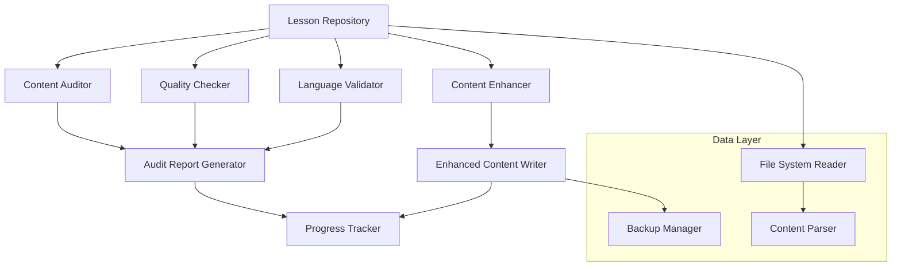

# Design Document: React Lessons Audit Enhancement

## Overview

The React Lessons Audit Enhancement system is designed to systematically analyze, validate, and improve educational content across all React lesson difficulty levels. The system provides automated content auditing, quality assessment, language consistency validation, and content enhancement capabilities to ensure comprehensive, high-quality educational materials in both English and Farsi languages.

The system operates on existing lesson data structures stored in hierarchical directories and processes both textual content and code examples to identify gaps, inconsistencies, and quality issues while providing mechanisms for systematic content improvement.

## Architecture

The system follows a modular architecture with distinct components for different aspects of content processing:



The architecture separates concerns between content analysis (auditing, quality checking, validation) and content modification (enhancement, writing), ensuring that analysis can be performed independently of modifications and that all changes are properly tracked and backed up.

## Components and Interfaces

### Lesson Repository
- **Purpose**: Central interface for accessing and managing lesson data
- **Responsibilities**: File system operations, data parsing, content structure management
- **Key Methods**:
  - `loadAllLessons()`: Loads lessons from all difficulty directories
  - `getLessonContent(lessonId)`: Retrieves specific lesson content
  - `updateLessonContent(lessonId, content)`: Updates lesson with enhanced content
  - `createBackup(lessonId)`: Creates backup before modifications

### Content Auditor
- **Purpose**: Systematic analysis of lesson content for completeness and structure
- **Responsibilities**: Content existence validation, structure analysis, gap identification
- **Key Methods**:
  - `auditAllLessons()`: Performs comprehensive audit across all lessons
  - `validateContentExists(lesson)`: Checks for presence of required content fields
  - `analyzeContentLength(lesson)`: Compares content length between languages
  - `identifyStructuralIssues(lesson)`: Detects formatting and organization problems

### Quality Checker
- **Purpose**: Assessment of educational value and content comprehensiveness
- **Responsibilities**: Content depth analysis, code example validation, educational value assessment
- **Key Methods**:
  - `assessContentQuality(content)`: Evaluates explanatory depth and clarity
  - `validateCodeExamples(examples)`: Checks code functionality and comments
  - `checkEducationalValue(lesson)`: Assesses learning objective coverage
  - `analyzeContentStructure(content)`: Validates formatting and organization

### Language Validator
- **Purpose**: Ensures consistency and equivalence between English and Farsi content
- **Responsibilities**: Cross-language comparison, terminology consistency, content parity validation
- **Key Methods**:
  - `compareLanguageVersions(lesson)`: Analyzes content equivalence between languages
  - `validateTerminologyConsistency(content)`: Checks technical term translations
  - `assessContentParity(englishContent, farsiContent)`: Measures content depth equivalence
  - `identifyLanguageGaps(lesson)`: Finds missing or insufficient translations

### Content Enhancer
- **Purpose**: Systematic improvement of lesson content quality and completeness
- **Responsibilities**: Content expansion, code example improvement, language gap filling
- **Key Methods**:
  - `enhanceContent(lesson, auditFindings)`: Improves content based on audit results
  - `expandExplanations(content)`: Adds depth and clarity to explanations
  - `improveCodeExamples(examples)`: Enhances code with comments and best practices
  - `fillLanguageGaps(lesson)`: Creates missing or insufficient translations

## Data Models

### Lesson Structure
```typescript
interface Lesson {
  id: string;
  title: string;
  difficulty: 'fundamentals' | 'intermediate' | 'advanced' | 'expert';
  content: string;           // English content
  contentFa: string;         // Farsi content
  codeExamples: CodeExample[];
  objectives: string[];
  metadata: LessonMetadata;
}

interface CodeExample {
  id: string;
  title: string;
  code: string;
  explanation: string;
  explanationFa: string;
  language: string;
}

interface LessonMetadata {
  lastModified: Date;
  version: string;
  author: string;
  reviewStatus: 'pending' | 'reviewed' | 'approved';
}
```

### Audit Results
```typescript
interface AuditResult {
  lessonId: string;
  findings: AuditFinding[];
  overallScore: number;
  recommendations: string[];
  timestamp: Date;
}

interface AuditFinding {
  type: 'missing_content' | 'quality_issue' | 'language_inconsistency' | 'structural_problem';
  severity: 'low' | 'medium' | 'high' | 'critical';
  description: string;
  location: string;
  suggestedFix: string;
}
```

### Enhancement Record
```typescript
interface EnhancementRecord {
  lessonId: string;
  changes: ContentChange[];
  enhancementType: 'content_expansion' | 'code_improvement' | 'language_addition' | 'structure_fix';
  timestamp: Date;
  validator: string;
}

interface ContentChange {
  field: string;
  originalValue: string;
  enhancedValue: string;
  changeReason: string;
}
```

## Correctness Properties

*A property is a characteristic or behavior that should hold true across all valid executions of a system—essentially, a formal statement about what the system should do. Properties serve as the bridge between human-readable specifications and machine-verifiable correctness guarantees.*

### Property 1: Complete Directory Scanning
*For any* file system containing React lesson directories, the Content_Auditor should discover and process all lessons across all difficulty levels (fundamentals, intermediate, advanced, expert)
**Validates: Requirements 1.1**

### Property 2: Content Validation Consistency
*For any* lesson with missing or incomplete content fields (content, contentFa, or both), the system should consistently flag the lesson as incomplete and identify the specific missing components
**Validates: Requirements 1.2, 1.3, 2.5**

### Property 3: Language Disparity Detection
*For any* lesson with content in both languages, when the content length ratio exceeds the configured threshold, the system should flag potential inconsistencies with appropriate severity levels
**Validates: Requirements 1.4, 3.5**

### Property 4: Quality Assessment Consistency
*For any* lesson content, the Quality_Checker should produce consistent quality scores based on explanation depth, readability, and educational value, regardless of content language or topic
**Validates: Requirements 2.1, 2.3, 6.1, 6.2**

### Property 5: Code Example Validation
*For any* code example in a lesson, the system should verify that the code is syntactically correct, includes adequate comments, follows best practices, and serves practical educational purposes
**Validates: Requirements 2.2, 4.2, 6.3**

### Property 6: Language Equivalence Validation
*For any* lesson with both English and Farsi content, the Language_Validator should verify that both versions cover equivalent React concepts, maintain consistent technical terminology, and provide comparable educational depth
**Validates: Requirements 3.1, 3.2, 3.3, 3.4**

### Property 7: Content Enhancement Preservation
*For any* lesson undergoing content enhancement, the Content_Enhancer should improve content quality while preserving technical accuracy, maintaining existing structure, and ensuring consistency with lesson objectives
**Validates: Requirements 4.1, 4.3, 4.4, 4.5**

### Property 8: File Processing Integrity
*For any* lesson file operation (read, parse, update, save), the Lesson_Repository should maintain data integrity, preserve metadata, ensure proper formatting, and handle both language properties correctly
**Validates: Requirements 5.1, 5.2, 5.3, 5.4**

### Property 9: Backup Creation Reliability
*For any* content modification operation, the system should create complete backup copies before making changes, ensuring data recovery capability and change traceability
**Validates: Requirements 5.5**

### Property 10: Comprehensive Reporting
*For any* audit or enhancement operation, the system should generate detailed reports containing specific findings, file locations, severity classifications, and actionable recommendations
**Validates: Requirements 1.5, 6.5, 7.1, 7.2, 7.3, 7.4, 7.5**

## Error Handling

The system implements comprehensive error handling across all components:

### File System Errors
- **Missing Directories**: Graceful handling when lesson directories don't exist
- **Permission Issues**: Clear error messages for file access problems
- **Corrupted Files**: Recovery mechanisms for malformed lesson data
- **Backup Failures**: Alternative backup strategies and user notification

### Content Processing Errors
- **Invalid JSON**: Robust parsing with detailed error reporting
- **Missing Required Fields**: Clear identification of missing lesson properties
- **Encoding Issues**: Proper handling of multi-language character encoding
- **Large File Handling**: Memory-efficient processing for extensive lesson content

### Enhancement Errors
- **Content Generation Failures**: Fallback mechanisms for enhancement operations
- **Quality Validation Failures**: Clear reporting when content doesn't meet standards
- **Language Processing Errors**: Graceful handling of translation and consistency issues
- **Concurrent Modification**: Conflict resolution for simultaneous content updates

### Reporting Errors
- **Report Generation Failures**: Alternative output formats and partial report generation
- **Data Aggregation Issues**: Robust handling of incomplete or inconsistent audit data
- **Export Problems**: Multiple output format options and error recovery

## Testing Strategy

The testing approach combines unit testing for specific functionality with property-based testing for comprehensive validation across diverse inputs.

### Unit Testing Focus
- **Component Integration**: Verify proper interaction between Content_Auditor, Quality_Checker, and other components
- **Edge Cases**: Test boundary conditions like empty files, extremely long content, and malformed data
- **Error Conditions**: Validate error handling for file system issues, parsing failures, and invalid inputs
- **Specific Examples**: Test known problematic lesson patterns and successful enhancement scenarios

### Property-Based Testing Configuration
- **Testing Library**: Use fast-check for JavaScript/TypeScript property-based testing
- **Test Iterations**: Minimum 100 iterations per property test to ensure comprehensive coverage
- **Input Generation**: Custom generators for lesson data, file structures, and content patterns
- **Shrinking Strategy**: Automatic reduction of failing test cases to minimal reproducible examples

### Property Test Implementation
Each correctness property will be implemented as a property-based test with the following configuration:
- **Minimum 100 iterations** per test due to randomization requirements
- **Custom data generators** for realistic lesson content, file structures, and audit scenarios
- **Comprehensive input coverage** including edge cases, malformed data, and boundary conditions
- **Test tagging** format: **Feature: react-lessons-audit-enhancement, Property {number}: {property_text}**

### Testing Balance
- **Property tests** handle comprehensive input coverage and universal correctness validation
- **Unit tests** focus on specific integration points, error conditions, and known edge cases
- **Integration tests** verify end-to-end workflows from audit through enhancement to reporting
- Both testing approaches are complementary and necessary for ensuring system reliability and correctness